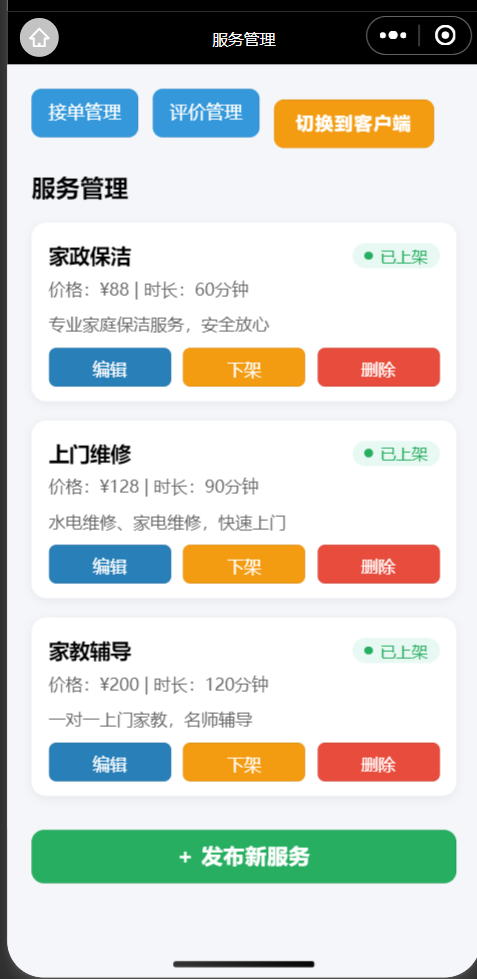
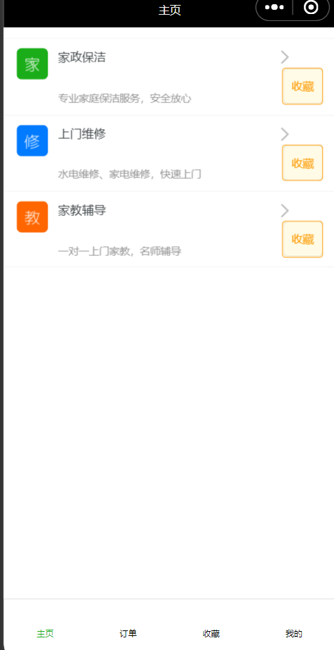
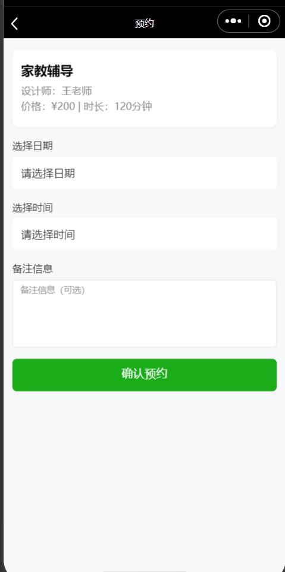
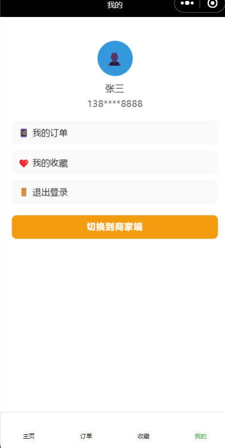

# uniapp-reserve-demo

> ⚠️ 本项目仅供学习、交流和面试使用，禁止任何形式的商业用途。如需商用，请联系作者获得授权。

## UI/UX 预览

> 以下为主要页面截图，展示用户端与商家端的核心功能与界面风格：

| 商家端服务管理 | 客户端首页 | 预约页 | 客户端个人中心 |
|:---:|:---:|:---:|:---:|
|  |  |  |  |

- **商家端服务管理**：服务发布、上下架、编辑、删除、切换客户端
- **客户端首页**：服务浏览、收藏
- **预约页**：服务预约、日期时间选择
- **个人中心**：订单、收藏、切换到商家端


## 项目简介

本项目是一个基于 uni-app 的预约服务小程序前端，配合本地 mock 服务实现前后端联调。支持用户端与商家端双角色切换，涵盖登录、服务预约、订单管理、收藏、服务发布/上下架等全流程，UI 现代，体验流畅。

---

## 主要功能
- **用户端**：
  - 手机号验证码登录/注册
  - 服务列表浏览、预约、收藏
  - 订单管理、收藏管理
  - 个人中心、切换身份
- **商家端**：
  - 手机号验证码登录
  - 服务管理（发布、编辑、上下架、删除）
  - 订单接单、完成、拒绝
  - 评价管理
  - 一键切换到客户端
- **全局**：
  - 角色切换无需重新登录，自动跳转
  - 数据与 mock 服务实时联动
  - 现代化 UI/UX，卡片式列表、状态标签、空状态提示

---

## mock 服务说明
- 基于 express 实现，端口默认 3000。
- 支持接口：
  - `/api/login` 登录
  - `/api/code` 获取验证码
  - `/api/user` 获取用户信息（roles 支持 user/merchant）
  - `/api/services` 服务列表（支持 status=on 过滤）
  - `/api/services/:id` 服务详情、上下架、删除
  - `/api/orders` 订单列表、下单、状态流转
  - `/api/favorites` 收藏增删查
- 启动 mock：
  ```bash
  node mock/server.js
  ```

---

## 启动和开发
1. 安装依赖：
   ```bash
   pnpm install
   # 或 npm install
   ```
2. 启动 mock 服务：
   ```bash
   node mock/server.js
   ```
3. 启动 uni-app 项目（HBuilderX 或 cli）：
   ```bash
   pnpm dev:mp-weixin
   # 或 npm run dev:mp-weixin
   ```
4. 使用微信开发者工具导入项目，调试小程序。

---

## 角色切换说明
- 登录后，点击“切换身份”按钮可在用户端/商家端一键切换，无需重新登录。
- 后端 `/api/user` 默认返回 `roles: ['user', 'merchant']`，前端自动判断跳转目标。
- 切换逻辑见 `src/utils/switchRole.ts`。

---

## 目录结构简述
- `src/pages/client/` 用户端页面
- `src/pages/merchant/` 商家端页面
- `src/components/` 通用组件
- `mock/server.js` 本地 mock 服务
- `src/utils/` 工具方法（如 request、switchRole）

---

## 贡献与协作
如需二次开发、团队协作，建议：
- 统一 mock 数据结构和接口
- 约定页面跳转和角色切换逻辑
- 组件化复用 UI 元素

---

如有问题欢迎提 issue 或联系维护者。 